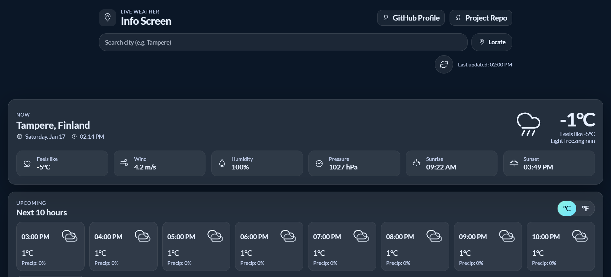

# Weather Info Screen

A tram-style **live weather info screen** built with **HTML, CSS, and JavaScript**.  
Search any city with **auto-suggestions**, or use **Locate** to fetch weather for your current position. It shows **current conditions + key metrics** and the **next 10 hours forecast**, with an auto refresh.

## 📸 Preview

## 🚀 Live Demo
👉 https://warunaslfi.github.io/JS-Weather-Info-Screen

## 🧰 Built With
- HTML
- CSS (Grid/Flex layout)
- JavaScript (Fetch API, DOM updates)
- WeatherAPI.com (weather data)

## 📚 What I Learned
- How to fetch and parse API data using `async/await`
- Updating the UI dynamically with DOM manipulation
- Building a clean UI layout using CSS Grid + Flexbox
- Implementing city suggestions (type-ahead search)
- Handling loading states and errors safely
- Auto-refreshing data on a timer

## ✅ Features
- City search + suggestions dropdown
- “Locate me” using browser geolocation
- Current weather + feels-like, wind, humidity, pressure
- Sunrise & sunset times
- Next 10 hours forecast
- °C / °F unit toggle
- Auto refresh every 5 minutes
